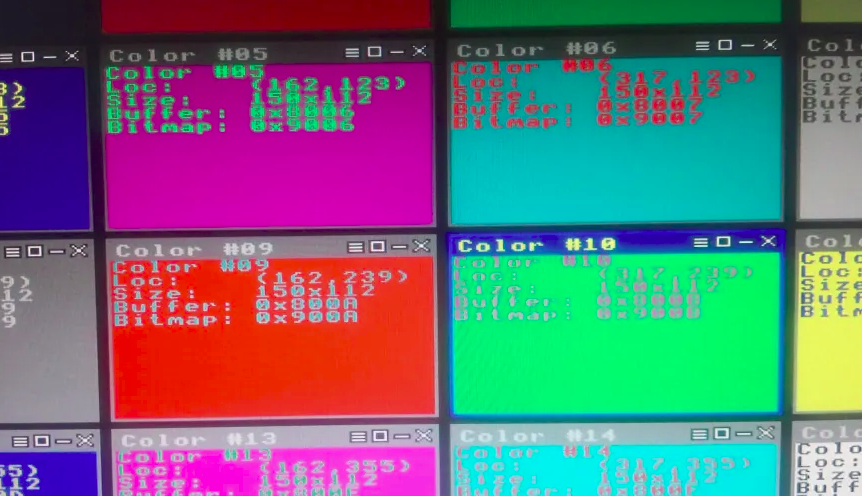

# <b>agwin</b> - Agon Windows
Manage window-based applications on Agon!



This repository contains an experimental Agon application that displays windows on the screen and allows other windows-based applications to be loaded and executed (either one-shot or stay-resident).

><b>NOTE!</b> This is not a complete window system in terms of providing common widgets, etc. It is a framework for drawing windows, which may be enhanced to include various widgets and typical window-based applications.

<b>agwin</b> provides a set of commmon "core" functions that may be called by applications. Some of them are intended to be called directly, using pointers from a jump table. Some may be used indirectly via window messages.

<b>agwin</b> is built using AgonDev, from this repository:

https://github.com/AgonPlatform/agondev/tree/master


## Essential Theory

### Window Tree

<b>agwin</b> maintains a tree (hierarchy) of windows, starting with the <i>root window</i>, which it creates during startup. All other windows are descendents of the root window.

The window structure contains many fields. Here are the ones related to the tree of windows:

```
typedef struct tag_AwWindow {
    AwWindow*       parent;         // points to the parent window
    AwWindow*       first_child;    // points to the first child window
    AwWindow*       last_child;     // points to the last child window
    AwWindow*       prev_sibling;   // points to the previous sibling window
    AwWindow*       next_sibling;   // points to the next sibling window
} AwWindow;

```

In terms of the display, for any particular window (<i>W</i>), the top-down visibility (layering) precedence is as follows:

* Highest precedence (front-most): first child window of <i>W</i>, if any (<i>first_child</i>).
* Middle precedence (just behind the front): the window <i>W</i> itself.
* Lowest precedence (rear-most): next sibling window of <i>W</i>, if any (<i>next_sibling</i>).

Windows are displayed by walking the window tree recursively, starting at the root window. Because of the precedence rules, the children of any window may partially or fully cover the area of that window. The window will cover its siblings (those having the same parent as the window), if it overlaps them.

<u>Do not assume</u> that the <i>first_child</i> points to the oldest child. It does not. New windows are inserted at the <i>head</i> of the list, rather than at the <i>tail</i>, causing <i>first_child</i> to point to the newest child. Thus, when child windows A, B, and C are created in that order, if they happen to overlap, then C will occlude B, and B will occlude A, because C was the <i>last</i> window created, and appears as the <i>first</i> window in the linked list. In short, <i>first_child</i> and <i>last_child</i> refer to items in the list, not to the timing of window creation.

### Screen Coordinates

<b>agwin</b> uses device coordinates for all of its operations, not logical coordinates, so it always turns off logical coordinate usage when establishing the viewports for drawing parts of windows.

```
typedef struct tag_AwRect {
    int16_t     left;       // inclusive left edge of the rectangle (this is inside the rectangle)
    int16_t     top;        // inclusive top edge of the rectangle (this is inside the rectangle)
    int16_t     right;      // exclusive right edge of the rectangle (this is outside the rectangle)
    int16_t     bottom;     // exclusive bottom edge of the rectangle (this is outside the rectangle)
} AwRect;
```

In <b>agwin</b>, the rectangles that are <i>used to manage windows</i> always use a typical computer graphics format, where the upper-left X coordinate (called <i>left</i>) is less than or equal to the lower-right X coordinate (called <i>right</i>), and the upper-left Y coordinate (called <i>top</i>) is less than or equal to the lower-right Y coordinate (called <i>bottom</i>). The upper-left coordinate is <i>included</i> within the rectangle, but the lower-right coordinate is <i>excluded</i>. With this format, it is easy to compute the width of the rectangle as <i>right-left</i>, and the height of the rectangle as <i>bottom-top</i>. Note that <b>agwin</b> automatically adjusts the lower-right coordinates, subtracting one (1) when establishing a viewport, because the VDP uses an <i>inclusive</i> endpoint.

The simplest empty rectangle (width=0 and height=0) has all 4 values as zeros. In fact, the "core_rect_is_empty()" function returns <i>true</i> if either the width or height is zero.

### Message Processing

The <b>agwin</b> main loop is little more than a message queue processor, with some extra checks for things like the keyboard, mouse, real-time clock, and a simple timer.

Events are posted to the message queue, and may be received by the <i>message handlers</i> of interested windows. A window shows interest in real-time clock and/or simple timer events by having a <i>window style</i> that has the corresponding flags set. A window is automatically interested in keyboard and mouse events when it is the currently <i>active</i> window.

<b>agwin</b> posts various messages to the queue, plus when required, it processes some messages directly, bypassing the queue. Processing a message means invoking the proper message handler function, giving the owning application a chance to do something with a window message. That invocation takes place on the <b>agwin</b> stack, not on any stack defined by the invoked application. More on that in the next section...

Message processing centers around the concept of <i>window classes</i>. A <i>class</i> in this case refers to one or more windows that have their window messages processed by a particular window message handler (function). Note that a window class may have a parent class, and when processing a message, <b>agwin</b> will start with the handler specific to the window, then move through each parent handler (based on the class hierarchy), unless it is told to <i>halt</i> processing for the message.

Parent versus child classes may be used to modify/enhance the message processing. For example, if a certain class is a child of the "edit box" class, it may provide specific handling of certain window messages, and pass those or other messages along to the "edit box" class, for further handling. Since the class pointers are easily accessible, the custom class function could invoke the parent class first, then add its own processing, and then halt further processing of the message.

### Application Loading

<b>agwin</b> allows other windows applications to be loaded and executed, meaning that after pulling an application into RAM (from SD card), <b>agwin</b> will call the <i>main(argc,argv)</i> function of the application. In doing so, <b>agwin</b> passes the name of the application as the first argument (typical in C), and a pointer to the <b>agwin</b> core function table (in ASCII hexadecimal) as the second argument. The application may keep a local copy of that pointer, so that it can call some core functions directly.

When an application is loaded, and <b>agwin</b> invokes its <i>main()</i> function, <b>agwin</b> expects that the function will do some initialization and return, because <b>agwin</b> runs a <i>cooperative multitasking</i> system on a single stack. Because the loaded application is a normal MOS application, it will create its own stack; however, that stack will only be useful <i>during</i> the <i>main()</i> function. For that reason, the loaded application should be compiled in such a manner as to keep its own stack as small as possible, to avoid wasting memory that might be useful for other additional applications.

Loaded applications may have their own heaps, but may also use core functions to access the <b>agwin</b> heap (i.e., to allocate and to free memory blocks).

The loaded application may do all of its work, and finish by exiting <i>main()</i>, or it may create one or more windows, and indicate that it should remain resident. This indication comes via the return value from <i>main()</i>. If that value ranges from just past the <b>agwin</b> memory area to just below the area of memory reserved by MOS, then the value is a pointer to the application structure (which contains a pointer to the list of <i>window classes</i> defined by the loaded application), and <b>agwin</b> expects that the application will remain resident, and remembers it in its own table of loaded applications. This makes it possible for <b>agwin</b> to kill any windows handled by that application when it is unloaded. If the <i>main()</i> return value is a number close to zero, as is typical for console error codes, then <b>agwin</b> does not record the application, and assumes that it will not care to remain resident.

### Window Drawing

<b>agwin</b> figures out which windows need to be drawn based on which windows are considered to be <i>invalid</i> in some way. A window may have a <i>dirty</i> title bar (e.g., the window title has changed), or it may have a dirty client area (i.e., the window content has changed), or it may be dirty all over (e.g., the window was resized). When a window or portion of a window is invalidated, <b>agwin</b> adds (unions) the invalid area to what it calls the <i>dirty area</i>. In its main loop, if there are no window messages in the queue, <b>agwin</b> will check whether the dirty area is empty. If it is not empty, then <b>agwin</b> will call functions to draw any windows that were marked as dirty, then display any windows that will repair the dirty area of the screen.

<b>agwin</b> does <i>not</i> need to redraw a clean window just to put it back onto the screen, because it keeps buffers in VDP (on the ESP32) to hold the pixels of each window. Thus, when required, it can <i>bitblt</i> (copy) sections (or all) of a window to the screen buffer, for display. In a 64-color screen mode, <b>agwin</b> keeps a single bitmap buffer in VDP. For paletted (less than 64-color) modes, <b>agwin</b> keeps a compacted pixel buffer, plus a separate bitmap buffer. All of these buffers are in PSRAM, implying the <b>agwin</b> requires PSRAM on the board!

<b>agwin</b> paints various sections of a window by creating and processing several window messages that cover the entire window, the window decorations, the title bar, the client area background, and the client area foreground. The message handling for any or all of these pieces may be overridden by an application.

Just because an application has a custom window message handler does not mean that the handler needs to handle every type of window message. It can choose to handle only certain messages that it deems to be important.

<b>agwin</b> will setup (establish) the VDP viewport for either the entire window, the title bar, or the client area, depending on what was dirty. In each case, when performing VDU operations to draw within the given area, an application should assume that the origin is at the beginning of the area, and treat that as (X,Y) coordinates of (0,0). The application generally should not care where the window is physically located on the screen, because <b>agwin</b> uses the <i>redirect drawing</i> feature to cause the drawing to happen against the VDP buffer that it keeps for the window, not against the screen buffer itself. It copies pixels from the window buffer(s) to the screen buffer after all dirty windows are redrawn.

> NOTE: Avoid drawing outside of the bounds of the given window area, as that could potentially crash the system. Also, unless you are very sure what you are doing, do not modify the viewport. You might want to consider using a child window rather than modifying the viewport, because <b>agwin</b> will setup the viewport when drawing the child window.

## Suggested Enhancements

* Modify <b>agwin</b> such that it uses the current screen mode and/or allows the mode to be passed as a command-line parameter to it, rather than having the screen mode (and size and number of colors) compiled in as C macros.
* Add more sanity checks into VDP regarding restricting drawing to buffers, and insuring that buffers are the correct size and color depth.
* Add support for 8-color modes. VDP supports them, but <b>agwin</b> does not.
* Change the dirty area from being a rectangle to being a region, so that if multiple non-overlapping windows get dirty, <b>agwin</b> does not have to re-copy portions of unchanged windows to the screen, when it shows the the updated windows.
* Make sure that a window becomes <i>active</i> when clicked by the mouse.
* Add core functions to lookup window classes by name, especially for any new classes defined by <b>agwin</b> itself, such as the "edit box" (which is suggested, but not implemented).
* Add code and windows messages to support common widgets, such as edit box, menu, list box, and icon (bitmap).
* Add code and windows messages to support a desktop. A desktop may be created in either of two ways: (1) as a separate application that is loaded, or (2) by using the root window pointer to manipulate the root window.
* Modify the window structure so that it can reference an icon for the window.
* Determine an approach for representing an icon bitmap for an application or for a window within an application. This could be something as simple as a file-naming convention (application versus bitmap file), or something more complex, involving the executable file format.
* Create a file explorer application.
* Create a text editor application.
* Create a terminal-like application, intended to run console applications (those that do not have their own custom windows).
* Modify argument passing to a loaded application so that user-defined arguments may be given to that application when loading it.
* Make a PC tool that can arrange the load addresses and memory sizes of multiple windows applications, so that they may be resident simultaneously without clobbering each other. This could be done by using strong MAKE variables to override the weak variables in the MAKE files for the applications. Alternatively, find a good way to compile relocatable code for the EZ80!
* When VDP supports proportional fonts better, add that to <b>agwin</b> and/or to applications built on it.

## Redirect Drawing

<b>agwin</b> <i>relies</i> on the "redirect drawing to buffer" capability in VDP. As such, it can only be run on an Agon that has a version of the VDP software that includes that capability.

Below is a reference to a sample window-based C (AgonDev) application, plus the source lines for a couple of BASIC applications used to test the "redirect" feature.

Note that if the VDU commands for "redirect" change, <b>agwin</b> will need to be modified accordingly.

### Sample Agon Windows App

Show a clock in a window:
https://github.com/TurboVega/winclock

### Sample BASIC Test App (16 colors)

```
   80 VDU 23,0,&C0,0
   90 PRINT"":PRINT""
  100 PRINT"Test program for Redirect Drawing to Buffer"
  101 PRINT"This app assumes using default Mode #0!"
  102 PRINT"This is printed directly to the screen."
  120 REM create bi-color buffer
  121 REM VDU 23, 0, &A0, bufferId; 0, length; <buffer-data>
  122 VDU 23, 0 &A0, 64001; 2: VDU 23,0,&A0,64001;0,200*200/2;
  123 FOR row%=0 TO 199
  124 FOR col%=0 TO 199 STEP 2
  125 VDU &67
  126 NEXT col%
  127 NEXT row%
  131 REM -- draw bi-color bitmap onto screen
  132 REM -- expand bi-color buffer into a bitmap
  133 REM -- VDU 23, 0, &A0, bufferId; 72, options, sourceBufferId; [width;] <mappingDataBufferId; | mapping-data...>
  134 VDU 23, 0 &A0, 64002; 2: VDU 23,0,&A0,64002;72,&04,64001;&C0,&C1,&C2,&C3,&C4,&C5,&C6,&C7,&C8,&C9,&CA,&CB,&CC,&CD,&CE,&CF
  135 REM -- Select bitmap (using a buffer ID)
  136 VDU 23,27,&20,64002;
  137 REM -- VDU 23, 27, &21, w; h; format: Create bitmap from selected buffer
  138 VDU 23,27,&21,200;200;1
  139 REM -- select buffer #2 (64002)
  140 VDU 23,27,0,2
  141 REM -- draw bitmap to screen
  142 VDU 25,&ED,400;100;

  145 REM -- redirect drawing to bitmap
  146 REM -- VDU 23, 0, &A0, bufferId; &31 [, width; height; colors]
  147 VDU 23,0,&A0,64001;&31,200;200;16
  150 PRINT TAB(1,1);"Drawn on buffer!"
  170 REM -- redirect drawing to screen
  172 VDU 23,0,&A0,&FFFF;&31

  181 REM draw modified bitmap onto screen
  182 REM expand modified buffer into a bitmap
  183 REM VDU 23, 0, &A0, bufferId; 72, options, sourceBufferId; [width;] <mappingDataBufferId; | mapping-data...>
  184 VDU 23, 0 &A0, 64003; 2: VDU 23,0,&A0,64003;72,&04,64001;&CF,&CE,&CD,&CC,&CB,&CA,&C9,&C8,&C7,&C6,&C5,&C4,&C3,&C2,&C1,&C0
  185 REM Select bitmap (using a buffer ID)
  186 VDU 23,27,&20,64003;
  187 REM VDU 23, 27, &21, w; h; format: Create bitmap from selected buffer
  188 VDU 23,27,&21,200;200;1
  189 REM select buffer #3 (64003)
  190 VDU 23,27,0,3
  191 REM draw bitmap to screen
  192 VDU 25,&ED,150;250;
```

### Sample BASIC Test App (64 colors)

```
   80 MODE 3: VDU 23,0,&C0,0
   90 PRINT"":PRINT""
  100 PRINT"Test program for Redirect Drawing to Buffer"
  101 PRINT"This app sets and uses Mode #3!"
  102 PRINT"This is printed directly to the screen."
  120 REM create solid color bitmap
  122 VDU 23,0,&A0,64002;0,200*50;
  123 FOR row%=0 TO 199
  124 FOR col%=0 TO 49
  125 VDU &C1
  126 NEXT col%
  127 NEXT row%
  131 REM -- draw solid color bitmap onto screen
  135 REM -- Select bitmap (using a buffer ID)
  136 VDU 23,27,&20,64002;
  137 REM -- VDU 23,27,&21,w; h; format: Create bitmap from selected buffer
  138 VDU 23,27,&21,200;50;1
  141 REM -- draw bitmap to screen
  142 VDU 25,&ED,400;30;

  145 REM -- redirect drawing to bitmap
  146 REM -- VDU 23,0,&A0,bufferId; &31 [,width; height; colors]
  147 VDU 23,0,&A0,64002;&31,200;50;64
  150 PRINT TAB(1,1);"Drawn on buffer!"
  170 REM -- redirect drawing to screen
  172 VDU 23,0,&A0,&FFFF;&31

  181 REM draw modified bitmap onto screen
  189 REM select buffer #2 (64002)
  190 VDU 23,27,&20,64002;
  191 REM draw bitmap to screen
  192 VDU 25,&ED,150;100;
```
